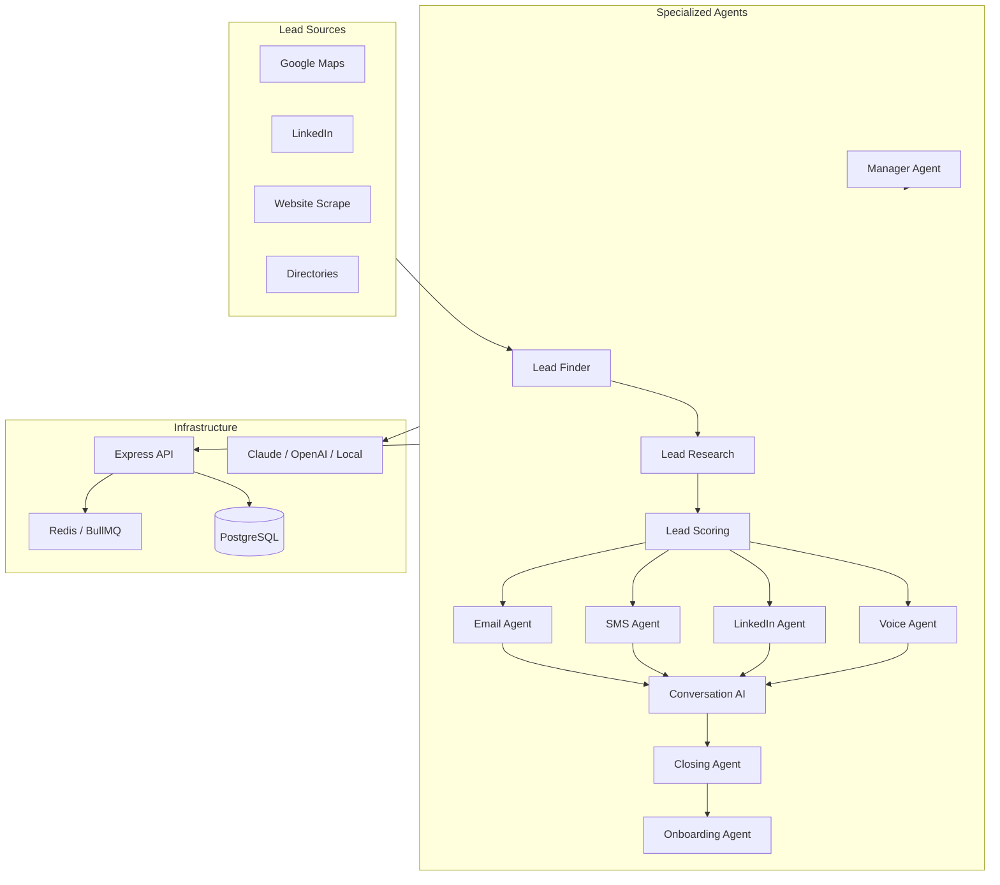

# Architecture

## Overview

Multi-agent autonomous sales system for B2B SMB outreach. Each agent owns one responsibility; a workflow orchestrator and BullMQ workers chain stages 24/7.

## Agent responsibilities

| Agent | Role |
|-------|------|
| Lead Finder | Discover prospects from configured sources |
| Lead Research | Website analysis, pain/opportunity/angle |
| Lead Scoring | 0–100 weighted score |
| Email / SMS / LinkedIn / Voice | Channel outreach with compliance gates |
| Conversation | Reply handling, objections, memory |
| Closing | Stripe checkout, deal stages |
| Onboarding | Welcome, account, checklist |
| Manager | Metrics, optimization recommendations |
| CRM (data layer) | Prisma models — leads, deals, conversations |

## LLM fallback chain

1. Anthropic (Claude) if `ANTHROPIC_API_KEY` set  
2. OpenAI if `OPENAI_API_KEY` set  
3. Local OpenAI-compatible (`LOCAL_LLM_URL`) e.g. Ollama  

## Compliance layer

All outbound channels pass `checkOutreachAllowed()`:

- Opt-out registry (email/phone)
- Lead-level opt-out flag
- TCPA quiet hours (SMS/voice)
- Daily rate limits per channel
- CAN-SPAM footer on email
- Full audit via `ComplianceLog`

## External integrations

| Service | Purpose |
|---------|---------|
| Resend | Email send + open tracking webhook |
| Twilio | SMS |
| Vapi / Bland / Retell | Voice AI (adapter stubs) |
| Stripe | Checkout + webhook → onboarding |
| n8n / Make | Webhook automation |
