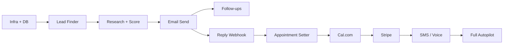

# Implementation Plan — 30 / 60 / 90–120 Days

**Product:** Autonomous B2B Sales Agent SaaS (NOT Real Estate Parcel Research)  
**Team:** Solo founder  
**Codebase:** `/sales-agent` monorepo only

---

## Executive summary

Build in three horizons on a single architecture so Phase 2/3 are **feature flags and agents**, not rewrites.

| Phase | Days | Goal |
|-------|------|------|
| **MVP** | 1–30 | Generate leads → email → qualify → book meetings → CRM |
| **Revenue** | 31–60 | Follow-ups, replies, Stripe, auth, first paying customers |
| **Autonomous** | 61–120 | SMS, LinkedIn, voice, closing, onboarding, manager optimization |

---

## Phase 1 — MVP (Days 1–30)

### Week 1: Foundation (Days 1–7)

| Day | Task | Deliverable |
|-----|------|-------------|
| 1–2 | Finalize architecture sign-off | This doc + `TECHNICAL_ARCHITECTURE.md` approved |
| 2–3 | Production Postgres + Redis (Neon + Upstash) | Env templates, migrations CI |
| 3–4 | Deploy skeleton: Vercel (web) + Railway (API) | Health checks green |
| 4–5 | **Lead Finder** — Google Places API adapter (real) ✅ | 50 leads from Maps query — see [GOOGLE_MAPS_SETUP.md](./GOOGLE_MAPS_SETUP.md) |
| 5–7 | Enrichment: website URL, email pattern, Apollo trial optional | Contacts on leads |

**Exit criteria:** `POST /api/control/discover` returns real businesses with websites.

### Week 2: Intelligence (Days 8–14)

| Day | Task | Deliverable |
|-----|------|-------------|
| 8–9 | **Lead Research** — website fetch + Claude/OpenAI structured JSON | `LeadResearch` populated |
| 10 | **Lead Scoring** — tune weights per playbook vertical | Scores correlate with manual review |
| 11–12 | **Email Agent** — Resend live send + CAN-SPAM footer | 10 test emails to your inboxes |
| 13–14 | Prompt library v1 in `prompts/` (versioned per playbook) | 8 vertical playbooks seeded |

**Exit criteria:** One lead goes NEW → CONTACTED with personalized email in &lt; 2 min.

### Week 3: Conversations & CRM (Days 15–21)

| Day | Task | Deliverable |
|-----|------|-------------|
| 15–16 | **Resend inbound webhook** + reply classifier job | Replies update `OutreachEvent.repliedAt` |
| 17–18 | **Appointment Setter** — Conversation agent + FAQ from playbook | Auto-replies to test inbound |
| 19–20 | **Cal.com** (or Calendly) — booking link in replies; `Meeting` model | Book test meeting end-to-end |
| 21 | CRM UI: lead detail page, conversation thread, status filters | Usable daily driver |

**Exit criteria:** Inbound test email → AI reply with booking link → meeting on calendar.

### Week 4: MVP hardening (Days 22–30)

| Day | Task | Deliverable |
|-----|------|-------------|
| 22–23 | **Follow-up sequence** — BullMQ delayed jobs (3/7/14 day) | 4-step sequence works |
| 24 | Compliance: opt-out page, daily caps, bounce handling | Legal minimum viable |
| 25–26 | **Clerk auth** + org isolation on all API routes | Multi-tenant safe |
| 27 | Dashboard: metrics, agent control (existing panel polish) | Founder can run without curl |
| 28 | n8n: daily discover cron + Slack alert on positive reply | Hands-off morning routine |
| 29–30 | Bug bash, 5 beta leads from real niche, demo video | **MVP launch** |

### MVP feature checklist

- [x] Lead Finder (prototype — wire real APIs)
- [x] Lead Research (prototype — requires LLM keys)
- [x] Lead Scoring
- [x] Email Outreach (prototype — wire Resend)
- [ ] Follow-up sequences
- [ ] Reply detection
- [ ] Appointment Setter + calendar
- [x] CRM dashboard (basic)
- [ ] Auth

---

## Phase 2 — Revenue (Days 31–60)

### Weeks 5–6: Monetization & reliability

| Task | Priority |
|------|----------|
| Stripe Checkout on high-intent leads | P0 |
| Pricing page + 2 packages ($2.5k pilot, $4k/mo growth) | P0 |
| Email deliverability: dedicated domain, SPF/DKIM, warmup | P0 |
| Sequence A/B testing (subject lines) | P1 |
| Lead detail: manual override, notes, pause agent | P0 |
| Export leads CSV | P2 |

**Revenue goal:** 2 paying pilots ($5k+ total).

### Weeks 7–8: Scale outreach

| Task | Priority |
|------|----------|
| Apollo or Clearbit enrichment at scale | P1 |
| Playbook editor UI (no code changes for copy) | P1 |
| SMS agent (Twilio) + TCPA quiet hours | P1 |
| LinkedIn agent (PhantomBuster or official API) — careful limits | P2 |
| HubSpot one-way sync (optional) | P2 |

**Revenue goal:** $10k MRR path defined; 4+ active clients or pilots.

---

## Phase 3 — Autonomous (Days 61–120)

### Days 61–90

| Task | Outcome |
|------|---------|
| **Voice agent** (Vapi) — outbound booking calls | Meetings without email |
| **Closing agent** — proposal + Stripe + contract (DocuSign) | Deals close in-product |
| **Onboarding agent** — welcome, checklist, kickoff scheduling | Post-sale automated |
| **Manager agent** — weekly auto-optimize subjects/channels | Less manual tuning |

### Days 91–120

| Task | Outcome |
|------|---------|
| Autopilot mode: daily discover → outreach → reply → book (human approval optional) | &lt; 10% human touches |
| Multi-org billing (Stripe Billing) | SaaS for other agencies |
| Voice + email unified conversation memory | Single thread per lead |
| Review / upsell campaigns | Expansion revenue |

---

## Build order (dependencies)

**Rule:** Do not build voice/SMS until email reply rate &gt; 3% on a niche.

---

## Solo founder weekly rhythm

| Day | Focus |
|-----|-------|
| Mon | Ship one agent feature; review metrics |
| Tue | Outbound to your own ICP list (dogfood) |
| Wed | Prompt tuning from real replies |
| Thu | Infra / bugs / compliance |
| Fri | Demo calls + document learnings |
| Sat–Sun | Optional: n8n workflows, content |

---

## Risk register

| Risk | Mitigation |
|------|------------|
| Email spam / domain burn | Low volume warmup; 50/day cap MVP |
| LLM cost spike | Cache research per domain 7d; use mini models for classify |
| LinkedIn account ban | Phase 2 only; manual approval first |
| TCPA on SMS/voice | Consent tracking; quiet hours enforced in code |
| Solo burnout | MVP scope frozen; say no to custom dev until $10k MRR |

---

## Definition of done

### MVP (Day 30)

1. 100 real leads in CRM from Google Maps niche query  
2. 50+ personalized emails sent  
3. 3+ positive replies handled by AI  
4. 1+ meeting booked via Cal.com  
5. Founder runs system from dashboard only  

### Revenue (Day 60)

1. $5k+ collected via Stripe  
2. Follow-up sequences running unattended 5 days  
3. Auth + one paying external customer  

### Autonomous (Day 120)

1. 80% of pipeline runs without daily manual discover  
2. SMS or voice live for one niche  
3. 2 deals closed with payment + onboarding in product  

---

## What to build next (immediate)

If starting from current prototype in `sales-agent/`:

1. **Day 1:** Add `GOOGLE_MAPS_API_KEY` + real Places adapter  
2. **Day 2:** Add `RESEND_API_KEY` + verify domain  
3. **Day 3:** Add `ANTHROPIC_API_KEY` or `OPENAI_API_KEY`  
4. **Day 4–7:** Follow-up queue + Resend inbound webhook  
5. **Day 8–14:** Cal.com + appointment setter polish  
6. **Day 15–30:** Clerk auth + production deploy  

See [TECHNICAL_ARCHITECTURE.md](./TECHNICAL_ARCHITECTURE.md) for system design details.

---

*Implementation Plan v1.0*
