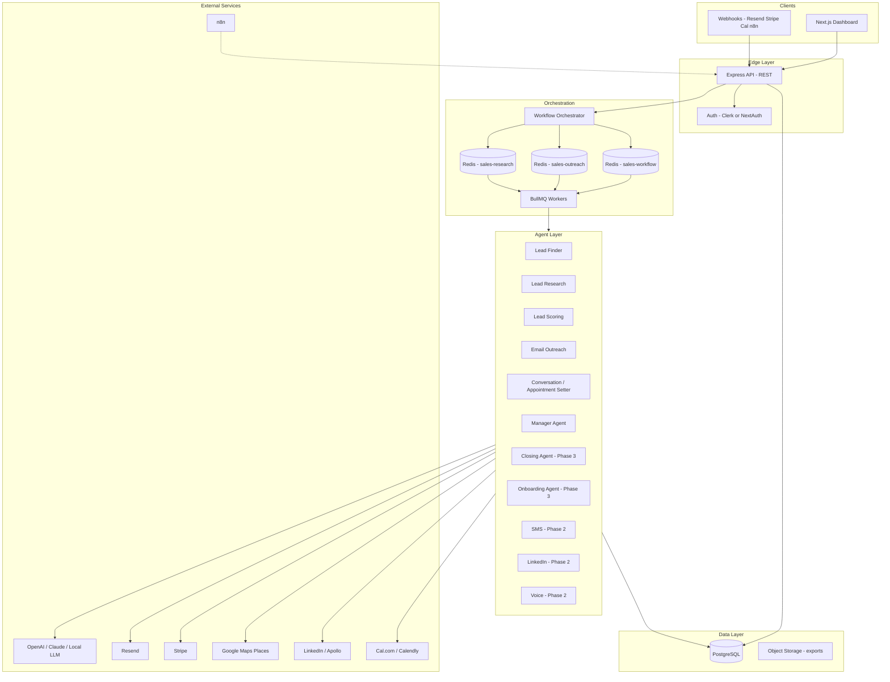
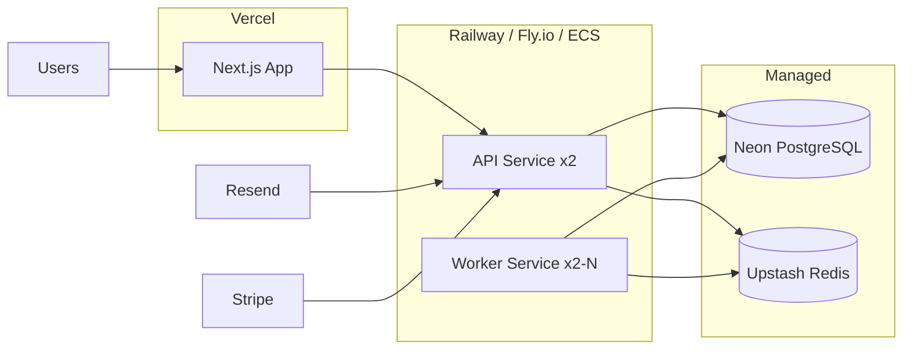
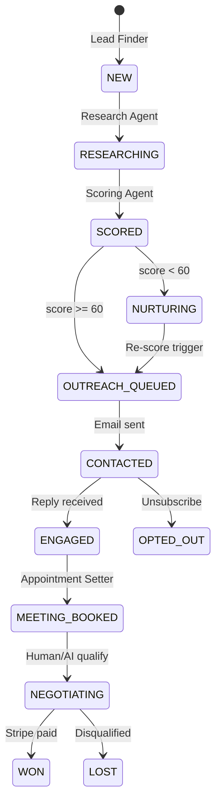

# Technical Architecture — Autonomous B2B Sales Agent SaaS

**Product:** Multi-agent system that generates leads, contacts prospects, qualifies them, books appointments, and closes deals with minimal human involvement.

**Explicitly separate from:** Real Estate Parcel Research Tool (different product, repo folder, database, and deployment).

**Operator model:** Solo founder  
**Stack:** Next.js, TypeScript, Node.js, PostgreSQL, Redis, OpenAI, Claude, Resend, Stripe, n8n

---

## 1. Product goals & success criteria

| Horizon | Outcome |
|---------|---------|
| **30 days (MVP)** | End-to-end path: discover → research → score → email → CRM → conversation → book meeting |
| **60 days (revenue)** | Paid pilots, reply handling, follow-up sequences, Stripe checkout, basic auth |
| **90–120 days (autonomous)** | SMS/LinkedIn/voice, closing agent, onboarding, manager optimization, &lt;10% human touches per deal |

**North-star metric:** Cost per qualified meeting &lt; $50 at scale.

---

## 2. System architecture



### 2.1 Layer responsibilities

| Layer | Responsibility |
|-------|----------------|
| **Web (Next.js)** | CRM UI, agent control panel, analytics, settings, playbook editor |
| **API (Express)** | REST, webhooks, auth middleware, rate limits, tenant isolation |
| **Orchestrator** | State machine per lead; enqueues jobs; idempotency keys |
| **Agents** | Single-purpose units with typed input/output and audit via `AgentRun` |
| **Workers** | Consume Redis queues; retry/backoff; dead-letter queue |
| **Database** | Source of truth for CRM, conversations, compliance logs |

### 2.2 Deployment architecture (production)



**Solo-founder default (low ops):**

- **Web:** Vercel (Next.js)
- **API + workers:** Railway (two services from same repo)
- **DB:** Neon PostgreSQL (free tier → scale)
- **Redis:** Upstash (serverless, pay per request)
- **Email:** Resend
- **Auth:** Clerk (fastest MVP) or NextAuth + magic link
- **Secrets:** Doppler or platform env vars
- **n8n:** Self-hosted on Railway or n8n Cloud for non-core automations

---

## 3. Multi-agent design

### 3.1 Agent catalog

| Agent | Phase | Input | Output | Triggers |
|-------|-------|-------|--------|----------|
| **Lead Finder** | 1 | source, query, geo, industry | `Lead[]` + contacts | Manual, schedule, n8n |
| **Lead Research** | 1 | leadId | pain, opportunity, angle, est. value | After find or on demand |
| **Lead Scoring** | 1 | leadId | score 0–100, breakdown | After research |
| **Email Outreach** | 1 | leadId, sequenceStep | outreachEvent, sent | score ≥ threshold |
| **Follow-up Email** | 1 | leadId, step | next email or stop | Cron / queue delay |
| **Reply Classifier** | 1 | inbound email | intent, sentiment | Resend webhook |
| **Conversation / Appointment Setter** | 1 | conversationId, message | reply, suggestedAction | Inbound reply/SMS later |
| **Meeting Booker** | 1 | leadId, slot prefs | Meeting record + calendar event | intent = book |
| **Manager** | 2 | period metrics | report + optimizations | Weekly cron |
| **SMS** | 2 | leadId | outreachEvent | playbook + TCPA check |
| **LinkedIn** | 2 | leadId | connection + message events | rate limits |
| **Voice Sales** | 2–3 | leadId, script | call transcript, outcome | quiet hours + consent |
| **Closing** | 3 | leadId, amount | Stripe session, Deal | buying intent |
| **Onboarding** | 3 | dealId | account, checklist | payment webhook |
| **CRM Sync** | 2 | — | external CRM update | Optional HubSpot |

### 3.2 Agent interface contract

Every agent implements:

```typescript
interface Agent<TIn, TOut> {
  readonly type: AgentType;
  run(ctx: AgentContext, input: TIn): Promise<AgentResult<TOut>>;
}

interface AgentContext {
  organizationId: string;
  leadId?: string;
  playbookId?: string;
  correlationId: string; // trace across pipeline
  metadata?: Record<string, unknown>;
}

interface AgentResult<T> {
  success: boolean;
  data?: T;
  error?: string;
  metrics?: Record<string, number>;
  nextActions?: WorkflowAction[]; // optional handoff
}
```

**Rules:**

1. Agents are **stateless**; all state in PostgreSQL.
2. Every run creates an **`AgentRun`** row (audit, debugging, billing).
3. Agents **never** call each other directly — only the **orchestrator** chains them.
4. LLM calls go through a single **`LLMService`** with provider fallback: Claude → OpenAI → local.

### 3.3 Lead lifecycle state machine



### 3.4 Agent communication model

Agents do **not** use peer-to-peer messaging in MVP. Communication is **orchestrator-mediated**:

```
┌─────────────┐     enqueue      ┌──────────────┐     dequeue     ┌─────────────┐
│ Orchestrator│ ───────────────► │ Redis Queue  │ ──────────────► │   Worker    │
└─────────────┘                  └──────────────┘                 └──────┬──────┘
       ▲                                                                  │
       │         write status / read lead                                  ▼
       └────────────────────────────── PostgreSQL ◄──────────────── Agent.run()
```

**Phase 2+ (optional):** Event bus pattern for analytics:

- Publish `lead.scored`, `email.sent`, `reply.received` to Redis Streams or n8n webhooks.
- Manager Agent subscribes to aggregate metrics (no tight coupling).

**Conversation memory:** Stored in `Conversation` + `ConversationMessage`; Appointment Setter reads last N messages + `LeadResearch` + `Playbook`.

---

## 4. Database schema

**ORM:** Prisma  
**Location:** `packages/database/prisma/schema.prisma`

### 4.1 Core entities (MVP)

| Entity | Purpose |
|--------|---------|
| `Organization` | Tenant (solo founder starts with one; multi-tenant ready) |
| `User` | Dashboard users, roles |
| `Playbook` | Product positioning per vertical (AI call center, logistics, etc.) |
| `Lead` | Company-level prospect |
| `Contact` | Decision makers |
| `LeadResearch` | AI research artifact |
| `Campaign` | Sequence definition |
| `OutreachEvent` | Every email/SMS/call attempt + tracking |
| `Conversation` | Thread per channel |
| `ConversationMessage` | Memory for appointment setter |
| `Meeting` | Booked appointments |
| `Deal` | Opportunity / revenue |
| `AgentRun` | Agent execution audit |
| `ComplianceLog` | CAN-SPAM, TCPA, opt-out |
| `OptOut` | Global suppression list |
| `WebhookEvent` | Inbound webhook store (idempotency) |

### 4.2 Phase 2 additions (planned migrations)

```prisma
// Illustrative — add when implementing Phase 2

model SequenceEnrollment {
  id           String   @id @default(cuid())
  leadId       String
  campaignId   String
  currentStep  Int      @default(0)
  nextRunAt    DateTime?
  status       String   // active | paused | completed
}

model CalendarConnection {
  id             String @id @default(cuid())
  organizationId String
  provider       String // calcom | calendly | google
  accessToken    String // encrypted
  bookingUrl     String?
}

model ApiCredential {
  id             String @id @default(cuid())
  organizationId String
  provider       String // google_maps | apollo | linkedin
  encryptedJson  String
}
```

### 4.3 Indexing strategy

- `Lead(organizationId, status)`, `Lead(organizationId, score DESC)`
- `OutreachEvent(leadId, channel)`, `OutreachEvent(status, scheduledFor)`
- `AgentRun(organizationId, createdAt DESC)`
- `OptOut(email)`, `OptOut(phone)`

---

## 5. Folder structure (target)

```
sales-agent/                          # Separate product root
├── apps/
│   ├── web/                          # Next.js 15 App Router
│   │   ├── src/app/                  # Routes: /, /leads, /deals, /settings
│   │   ├── src/components/           # CRM UI, AgentControlPanel
│   │   └── src/lib/                  # API client, auth
│   └── api/                          # Express + workers
│       ├── src/agents/               # One file per agent
│       ├── src/routes/               # REST + webhooks
│       ├── src/services/             # LLM, compliance, email, calendar
│       ├── src/workflows/            # Orchestrator, state machine
│       ├── src/workers/              # BullMQ consumers
│       └── src/prompts/              # Versioned prompt templates
├── packages/
│   ├── database/                     # Prisma schema + migrations
│   └── shared/                       # Types, scoring weights, constants
├── docs/
│   ├── TECHNICAL_ARCHITECTURE.md     # This document
│   └── IMPLEMENTATION_PLAN.md        # 30/60/90-day execution plan
├── docker-compose.yml                # Local Postgres + Redis
└── package.json                      # npm workspaces
```

**Do not mix** with real-estate or trading code at repo root.

---

## 6. API endpoints

Base: `https://api.yourproduct.com` (or `/api-backend` proxy via Next.js in dev)

### 6.1 Auth (Phase 1b – days 20–30)

| Method | Path | Description |
|--------|------|-------------|
| POST | `/auth/signup` | Org + user creation |
| POST | `/auth/login` | Session/JWT |
| GET | `/auth/me` | Current user + org |

*Prefer Clerk: use Clerk middleware; skip custom auth routes.*

### 6.2 CRM

| Method | Path | Description |
|--------|------|-------------|
| GET | `/api/leads` | List leads (filter, sort, paginate) |
| GET | `/api/leads/:id` | Lead detail + research + conversations |
| PATCH | `/api/leads/:id` | Update status, assign playbook |
| GET | `/api/deals` | Pipeline |
| GET | `/api/dashboard/metrics` | KPIs |

### 6.3 Agent control

| Method | Path | Description |
|--------|------|-------------|
| GET | `/api/control/status` | Recent runs, lead count |
| POST | `/api/control/discover` | `{ source, query, limit, mode }` |
| POST | `/api/control/pipeline/:leadId` | Run research → score → email |
| POST | `/api/control/manager-report` | Manager agent |
| POST | `/api/control/checkout` | Closing agent (Phase 3) |

### 6.4 Outreach & conversations

| Method | Path | Description |
|--------|------|-------------|
| POST | `/api/campaigns` | Create sequence |
| POST | `/api/conversations/:id/messages` | Simulate inbound / manual reply |
| POST | `/api/meetings` | Book meeting (or via agent) |

### 6.5 Webhooks (public, signed)

| Method | Path | Source |
|--------|------|--------|
| POST | `/webhooks/resend` | Opens, clicks, replies |
| POST | `/webhooks/stripe` | Payment completed |
| POST | `/webhooks/n8n` | Custom automations |
| POST | `/webhooks/calcom` | Booking confirmed (Phase 1) |

### 6.6 Compliance

| Method | Path | Description |
|--------|------|-------------|
| POST | `/api/opt-out` | CAN-SPAM unsubscribe |

---

## 7. Authentication & multi-tenancy

### 7.1 Recommended approach (solo founder MVP)

**Clerk** (or Auth.js) integrated in Next.js:

- Organizations map 1:1 to `Organization` table (sync on first login via webhook).
- API validates `Authorization: Bearer <clerk_jwt>` or session cookie forwarded from Next.js Route Handlers.
- Row-level security: every query includes `organizationId` from JWT claims.

### 7.2 Roles

| Role | Permissions |
|------|-------------|
| `ADMIN` | Billing, API keys, playbooks, limits |
| `OPERATOR` | Run agents, edit leads, view revenue |
| `VIEWER` | Read-only CRM |

### 7.3 API keys (Phase 2)

For n8n and integrations: `Organization` settings store hashed API keys with scopes (`leads:write`, `webhooks:read`).

---

## 8. Queue architecture

### 8.1 Queues (BullMQ + Redis)

| Queue | Purpose | Concurrency | Default delay |
|-------|---------|-------------|---------------|
| `sales-workflow` | Pipeline steps, discover batches | 2 | — |
| `sales-outreach` | Email/SMS send, follow-ups | 5 | per sequence |
| `sales-research` | Heavy website LLM analysis | 3 | — |
| `sales-reply` | Inbound classification + auto-reply | 10 | — |
| `sales-dlq` | Failed jobs after 3 retries | 1 | manual review |

### 8.2 Job types

```typescript
type WorkflowJob =
  | { type: "full_pipeline"; organizationId: string; leadId: string }
  | { type: "discover"; organizationId: string; source: string; query: string }
  | { type: "follow_up"; organizationId: string; leadId: string; step: number }
  | { type: "process_reply"; organizationId: string; outreachEventId: string }
  | { type: "close_and_onboard"; organizationId: string; leadId: string; amount: number };
```

### 8.3 Scheduling

- **Follow-ups:** BullMQ `delay` = 3d, 7d, 14d per campaign step.
- **Daily discover:** n8n cron → `POST /api/control/discover` OR BullMQ repeatable job.
- **Rate limits:** Enforced in `ComplianceService` before enqueue (not only at send).

### 8.4 Idempotency

- Webhooks: store `provider + eventId` in `WebhookEvent`; skip duplicates.
- Outreach: `idempotencyKey = leadId + campaignId + step` prevents double-send.

---

## 9. Email outreach & reply detection (Phase 1 detail)

### 9.1 Send flow

1. Email Agent generates subject/body via LLM + playbook.
2. Compliance: opt-out check, daily cap, CAN-SPAM footer.
3. Resend API send → store `externalId` on `OutreachEvent`.
4. Update lead status → `CONTACTED`.

### 9.2 Follow-up sequence (MVP)

```json
[
  { "step": 0, "delayDays": 0, "template": "initial" },
  { "step": 1, "delayDays": 3, "template": "bump_1" },
  { "step": 2, "delayDays": 7, "template": "bump_2" },
  { "step": 3, "delayDays": 14, "template": "breakup" }
]
```

Stop sequence on: reply, opt-out, meeting booked, deal won.

### 9.3 Reply detection

1. Resend inbound webhook OR polling (prefer webhook).
2. `process_reply` job: classify intent (interested / question / objection / not interested).
3. Conversation Agent drafts reply; if `suggestedAction === book_meeting` → Meeting Booker.
4. Notify founder via email/Slack for high-intent replies (optional n8n).

---

## 10. AI appointment setter

**Agent:** `ConversationAgent` + `MeetingBookerService`

**Capabilities (MVP):**

- Answer FAQs from playbook (pricing, timeline, services).
- Handle objections using playbook rules + ethical templates.
- Propose 2–3 meeting slots (Cal.com embed link or API).
- On confirmation: create `Meeting` row, send calendar invite, set lead → `MEETING_BOOKED`.

**LLM prompt inputs:** playbook, research (pain/angle), conversation memory (last 20 messages), available slots.

**Human-in-the-loop (60-day):** Slack notification when confidence &lt; 0.7 or deal size &gt; threshold.

---

## 11. Target markets & playbooks

Each vertical gets a `Playbook` row:

| Slug | ICP | Primary pain |
|------|-----|--------------|
| `ai-call-center` | 10–100 employee service businesses | Missed calls, staffing |
| `ai-chatbots` | E-commerce, local services | After-hours leads |
| `business-automation` | Ops-heavy SMBs | Manual workflows |
| `web-development` | Businesses with outdated sites | Conversion / speed |
| `marketing-automation` | B2B services | Lead follow-up |
| `logistics-software` | Couriers, 3PL | Routing, dispatch |
| `courier-software` | Local delivery | Real-time tracking |
| `local-services` | HVAC, dental, legal | Booking + intake |

Playbook drives: scoring weights, email tone, objection handlers, pricing presented.

---

## 12. Security model

| Area | Control |
|------|---------|
| **Transport** | TLS everywhere; HSTS on web |
| **Auth** | JWT/sessions; org isolation on every DB query |
| **Secrets** | Env vars only; encrypt `ApiCredential` at rest (Phase 2) |
| **Webhooks** | Verify Resend/Stripe signatures |
| **PII** | Leads contain email/phone; GDPR-ready export/delete on `Lead` |
| **Compliance** | Opt-out, quiet hours (TCPA for SMS/voice), audit `ComplianceLog` |
| **LLM** | No PII in logs; redact prompts in production |
| **Rate limiting** | Express rate-limit per IP + per org on control endpoints |
| **Spam prevention** | Daily send caps, domain warmup guidance, bounce handling |

---

## 13. n8n integration

**Role:** Glue for solo founder — not core logic.

| Workflow | Trigger | Action |
|----------|---------|--------|
| Daily lead gen | Cron 6am | HTTP → `/api/control/discover` |
| High-intent alert | Webhook `reply.received` | Slack + pause sequence |
| CRM backup | Weekly | Export leads to Google Sheets |
| Invoice follow-up | Stripe webhook via n8n | Accounting tool |

Core agents stay in Node.js; n8n for schedules and notifications you can change without deploys.

---

## 14. Cost estimates (monthly)

Assumptions: 500 leads/month, 2,000 emails, 200 LLM research calls, solo founder.

| Service | MVP (30d) | Revenue (60d) | Autonomous (90d+) |
|---------|-----------|---------------|-------------------|
| Vercel | $0–20 | $20 | $20 |
| Railway API+workers | $5–20 | $30 | $60 |
| Neon Postgres | $0–19 | $19 | $49 |
| Upstash Redis | $0–10 | $10 | $25 |
| Resend | $0–20 | $20 | $80 |
| OpenAI + Claude | $30–80 | $100 | $300 |
| Clerk | $0–25 | $25 | $25 |
| Google Maps / Apollo | $0–50 | $50 | $100 |
| Cal.com | $0 | $0–12 | $12 |
| Stripe | 2.9% + 30¢ | pass-through | pass-through |
| **Total infra** | **~$50–150** | **~$250–400** | **~$600–900** |

**Revenue target (60d):** 2–4 pilot clients × $2,500–5,000 = $5k–20k to cover costs.

---

## 15. Future phases (architecture hooks)

Already in schema or stubbed in code — enable without redesign:

| Capability | Extension point |
|------------|-----------------|
| SMS | `OutreachChannel.SMS`, Twilio service, TCPA in compliance |
| LinkedIn | `LeadFinder` adapter, `OutreachChannel.LINKEDIN` |
| Voice | `VoiceAgent`, Vapi/Bland/Retell adapter, call transcripts in `ConversationMessage` |
| Closing | `ClosingAgent`, Stripe checkout, `Deal` stages |
| Onboarding | `Onboarding` model, post-payment webhook |
| Autonomous | `ManagerAgent` optimizes sequences; reduces human approval threshold over time |

---

## 16. Current codebase status

| Component | Status |
|-----------|--------|
| Prisma schema | ✅ Complete for MVP+future |
| Lead Finder / Research / Scoring / Email | ✅ Prototype (adapters mock without API keys) |
| Conversation / Closing / Onboarding / Manager | ✅ Prototype |
| CRM dashboard + agent control | ✅ Basic |
| Auth | ❌ Not implemented — use Clerk in days 20–30 |
| Follow-up sequences | ❌ Schema ready; worker logic needed |
| Reply detection | ❌ Resend webhook stub only |
| Cal.com booking | ❌ Planned |
| SMS / LinkedIn / Voice | ❌ Phase 2 |

---

## 17. Related documents

- [IMPLEMENTATION_PLAN.md](./IMPLEMENTATION_PLAN.md) — Week-by-week 30/60/90-day plan
- [DATABASE.md](./DATABASE.md) — Schema reference
- [API.md](./API.md) — Endpoint reference
- [AGENT_WORKFLOWS.md](./AGENT_WORKFLOWS.md) — Pipeline steps
- [DEPLOYMENT.md](./DEPLOYMENT.md) — Deploy guide
- [SCALING_ROADMAP.md](./SCALING_ROADMAP.md) — Technical scaling
- [REVENUE_MODEL.md](./REVENUE_MODEL.md) — Pricing & unit economics

---

*Version 1.0 — Autonomous Sales Agent SaaS (separate product)*
